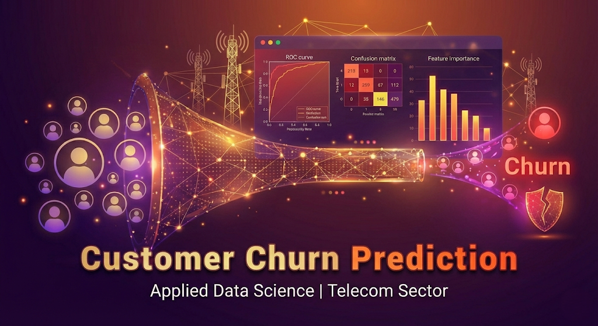

<div align="center">
  <a href="report.md">
    
  </a>
  <p><em>Click the banner to view the full analysis report</em></p>
</div>

# 📉 Telecom Customer Churn Prediction

  

## 📌 Business Problem
Customer churn (attrition) is a critical metric for telecom companies. Acquiring a new customer costs **5-25x more** than retaining an existing one. 
In this project, we analyzed a dataset of **7,043 customers** to identify:
1.  **Who** is leaving? (Predictive Modeling)
2.  **Why** are they leaving? (Diagnostic Analysis)
3.  **How** can we stop them? (Strategic Recommendations)

## 📂 Project Structure
```
Customer_Churn_Analysis_R/
│── README.md               # Project overview and business insights
│── report.Rmd              # Detailed technical report (R Markdown)
│── report.html             # Rendered report (for sharing)
│── data/
│   ├── telecom_churn.csv         # Raw dataset
│   └── telecom_churn_clean.rds   # Cleaned R object
│── images/                 # Project assets
│   └── cover_image.png           # (Save the new AI image here)
│── scripts/
│   ├── 01_data_cleaning.ipynb    # Data preprocessing pipeline
│   ├── 02_eda.ipynb              # Exploratory Data Analysis
│   └── 03_modeling.ipynb         # Model training & evaluation
└── results/
    ├── eda_contract.png          # EDA Plot: Contract Type
    ├── eda_internet.png          # EDA Plot: Internet Service
    ├── eda_payment.png           # EDA Plot: Payment Method
    ├── eda_tenure_charges.png    # EDA Plot: Tenure & Charges
    └── feature_importance.png    # Random Forest Feature Importance
```
## 📊 Exploratory Data Analysis (EDA)
Our analysis revealed several high-risk segments.

### 📁 Dataset
- **Source:** [IBM Telco Customer Churn Dataset (Kaggle)](https://www.kaggle.com/datasets/blastchar/telco-customer-churn)
- **Original Size:** 7,043 Rows
- **Cleaned Size:** 7,032 Rows (11 rows with missing values removed)
- **Target Variable:** `Churn` (Yes / No)

### 1. Contract Type
Customers with **Month-to-month** contracts are extremely likely to churn compared to 1 or 2-year contracts.


### 2. Payment Method
**Electronic Check** users have the highest churn rate, nearly double that of credit card users.


### 3. Internet Service
Users with **Fiber Optic** service churn at much higher rates than DSL or No Internet users.


### 4. Tenure & Charges
New customers (0-12 months tenure) and those with higher monthly charges are the most vulnerable.


## 🧠 Machine Learning Results
We built a predictive engine using **Logistic Regression** and **Random Forest**.
Models were trained using stratified train/test splits and evaluated via ROC-AUC.

| Model | Accuracy | AUC-ROC |
| :--- | :--- | :--- |
| **Logistic Regression** | **82.5%** | **0.86** |
| Random Forest | 80.6% | 0.85 |

*Note: The Logistic Regression model was selected for its balance of high accuracy and interpretability.*

## 📈 Top Drivers of Churn
According to our Random Forest model, these are the most important factors predicting if a user will leave:


1.  **Total Charges:** Indicates high-value customers are sensitive to total spend.
2.  **Tenure:** Loyalty is a strong predictor of retention.
3.  **Monthly Charges:** Higher monthly bills correlate with higher churn.

## 🚀 Recommendations
1.  **Incentivize Contracts:** Offer a 10% discount to Month-to-month users if they switch to a 1-year contract.
2.  **Target New Users:** Implement a "First 90 Days" onboarding program to support new customers (low tenure).
3.  **Investigate Fiber Optic:** The high churn in Fiber Optic suggests a pricing or quality issue that needs an audit.
> **💰 Business Impact:** A 5% reduction in churn among month-to-month customers could lead to substantial cost savings, as retaining existing users is 5-25x cheaper than acquiring new customers.

## View the Report

📄 **[View Full Analysis Report](https://htmlpreview.github.io/?https://github.com/sanaurrehmanarain/Customer_Churn_Analysis_R/blob/main/report.html)** - Download `report.html` and open in your browser for the complete interactive report with all visualizations and code.

---

## 🛠️ Tech Stack
* **Language:** R
* **Libraries:** `tidyverse`, `tidymodels`, `ggplot2`, `vip`

## ▶️ How to Run
1. Clone the repository
2. Install required R packages:
   install.packages(c("tidyverse", "tidymodels", "ggplot2", "vip"))
3. Run `churn_analysis.R` to reproduce the analysis and models

---
*Author: Sana Ur Rehman Arain*