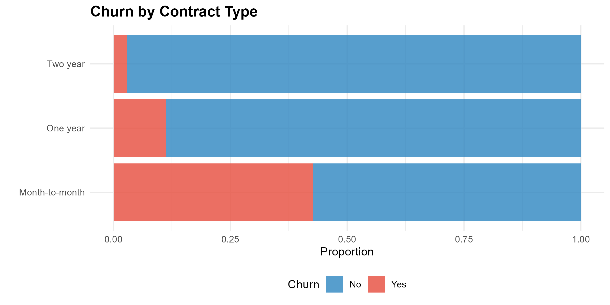
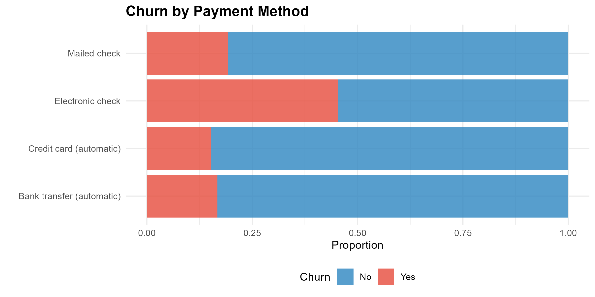
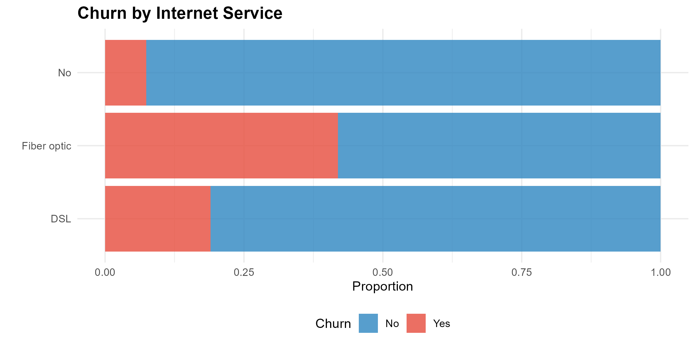
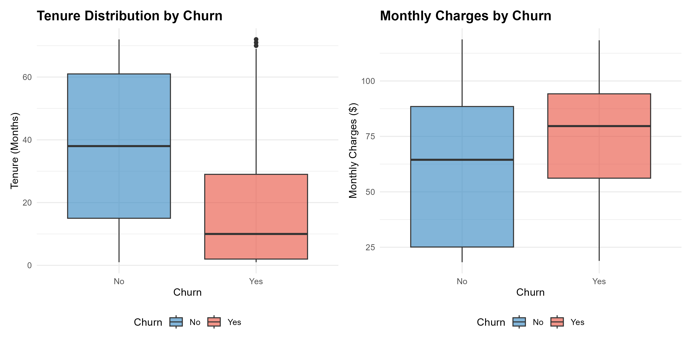
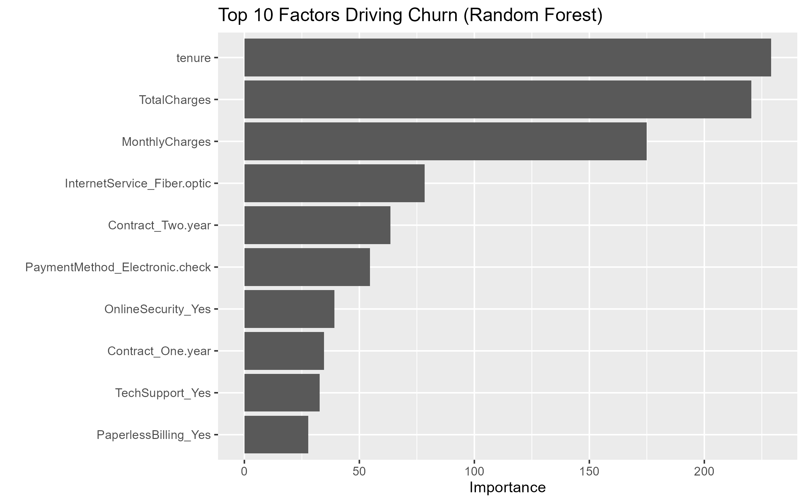

```{r setup, include=FALSE}
knitr::opts_chunk$set(
  echo = FALSE,
  warning = FALSE,
  message = FALSE,
  fig.align = "center"
)

library(tidyverse)
library(knitr)
```

---

## Executive Summary

Customer churn is a critical challenge for telecom companies, as acquiring a new customer is **5–25x more expensive** than retaining an existing one.

In this project, we analyzed the **Telco Customer Churn dataset (7,043 customers)** and built predictive models to identify customers at risk of leaving.

### Key Results

* **Overall churn rate:** 26.6%
* **Best model:** Logistic Regression

  * Accuracy: **82.5%**
  * AUC-ROC: **0.86**
* **Highest-risk segments:**

  * Month-to-month contract users
  * Electronic Check payment users
  * Fiber Optic internet customers
  * New customers (tenure < 12 months)

### Business Impact

A **5% reduction in churn among month-to-month customers** could generate substantial cost savings, as retention is significantly cheaper than customer acquisition.

---

## Data Overview

We used the **IBM Telco Customer Churn dataset**, which contains customer demographic information, account details, and service usage.

* **Rows:** 7,043
* **Columns:** 21
* **Target Variable:** `Churn` (Yes / No)

```{r}
df <- readRDS("data/telecom_churn_clean.rds")
```

---

## Class Distribution

The dataset is moderately imbalanced, with a larger proportion of retained customers.

```{r}
df %>%
  count(Churn) %>%
  mutate(Percentage = round(n / sum(n) * 100, 1)) %>%
  kable(col.names = c("Status", "Count", "Percentage (%)"))
```

---

## Exploratory Data Analysis (EDA)

EDA was conducted to identify behavioral and service-related drivers of churn.

### Contract Type

Customers on **month-to-month contracts** exhibit substantially higher churn rates compared to those on long-term contracts.

```{r, fig.cap="Churn Rate by Contract Type"}

```

---

### Payment Method

Customers using **Electronic Check** experience nearly **double the churn rate** compared to credit card or bank transfer users.

```{r, fig.cap="Churn Rate by Payment Method"}

```

---

### Internet Service

Fiber Optic users churn at significantly higher rates than DSL or no-internet customers, suggesting potential pricing or service quality issues.

```{r, fig.cap="Churn Rate by Internet Service"}

```

---

### Tenure & Monthly Charges

Churn is highest among:

* **New customers (0–12 months tenure)**
* Customers with **higher monthly charges**

```{r, fig.cap="Churn by Tenure and Monthly Charges"}

```

---

## Modeling Approach

We employed the **Tidymodels** framework to build and evaluate classification models.

### Methodology

* **Train/Test Split:** 75% / 25% (stratified by churn)
* **Preprocessing:**

  * Normalization of numeric variables
  * Dummy encoding of categorical features
* **Models Trained:**

  * Logistic Regression (interpretability)
  * Random Forest (non-linear relationships)

---

## Model Performance

| Model                   | Accuracy  | AUC-ROC  |
| ----------------------- | --------- | -------- |
| **Logistic Regression** | **82.5%** | **0.86** |
| Random Forest           | 80.6%     | 0.85     |

**Note:** AUC-ROC measures the model’s ability to distinguish between churners and non-churners. A score above 0.85 indicates excellent performance.

---

## Feature Importance

Using the Random Forest model, we extracted feature importance scores to understand the key drivers of churn.

```{r, fig.cap="Top Predictors of Customer Churn"}

```

### Interpretation

* **Total Charges & Monthly Charges:** High-spending customers are more sensitive to service dissatisfaction.
* **Tenure:** Customer loyalty increases significantly over time.
* **Fiber Optic Service:** A major contributor to churn risk.

---

## Conclusions & Recommendations

### Key Takeaways

* Churn is heavily influenced by **contract type, tenure, and billing factors**
* Logistic Regression provides a strong balance of **performance and interpretability**
* Early intervention is critical for new customers

### Strategic Recommendations

1. **Contract Migration Campaign**
   Offer incentives to move month-to-month customers to 1-year contracts.

2. **Fiber Optic Service Audit**
   Investigate pricing, performance, and customer complaints.

3. **Payment Method Nudge**
   Encourage Electronic Check users to adopt Auto-Pay with a one-time bill credit.

---